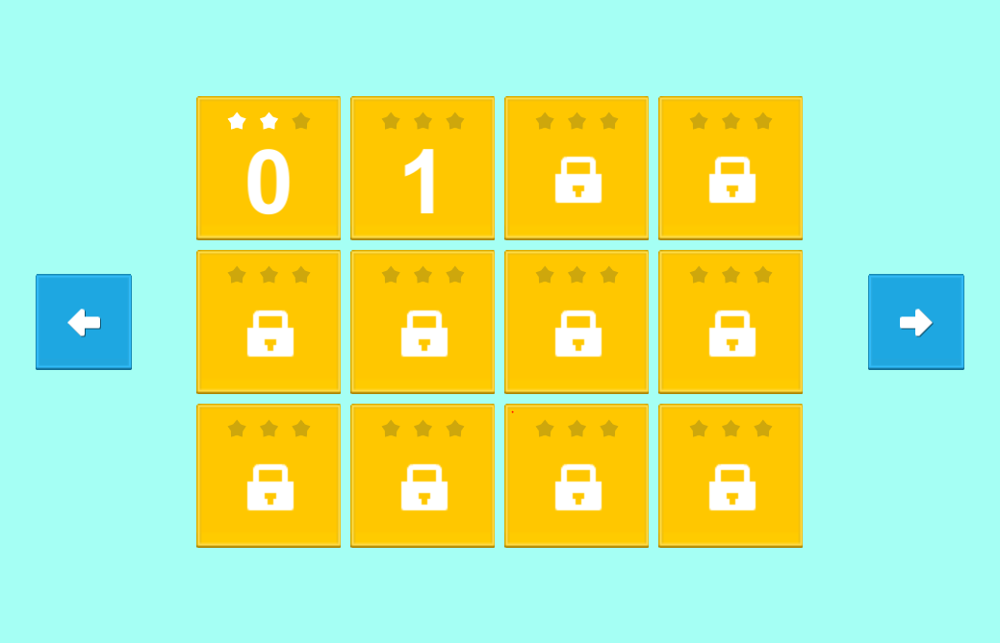

# LevelSelection 
This project is part of my training course in Zenva online Unity degree. This is a generic Level Selection system that dynamically builds and showcases the progress of the player in the levels of a game. Feel free to clone it and play with it. 

